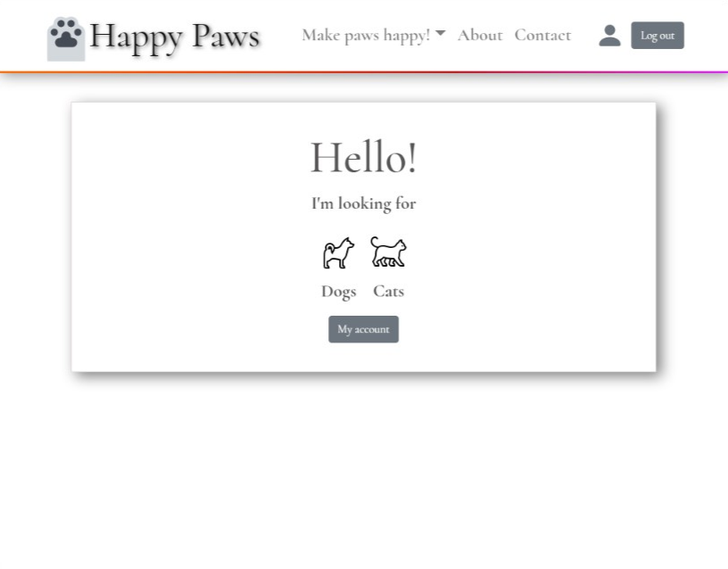
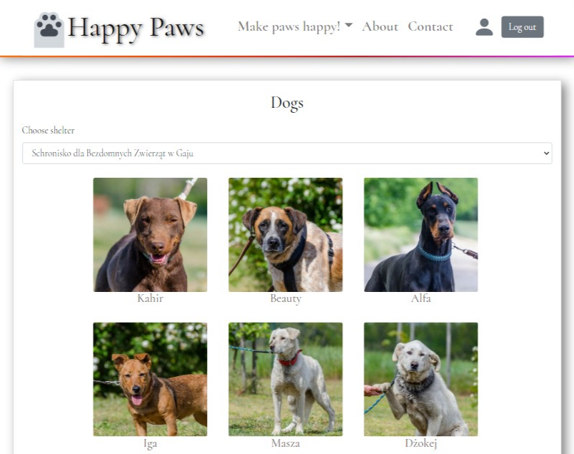
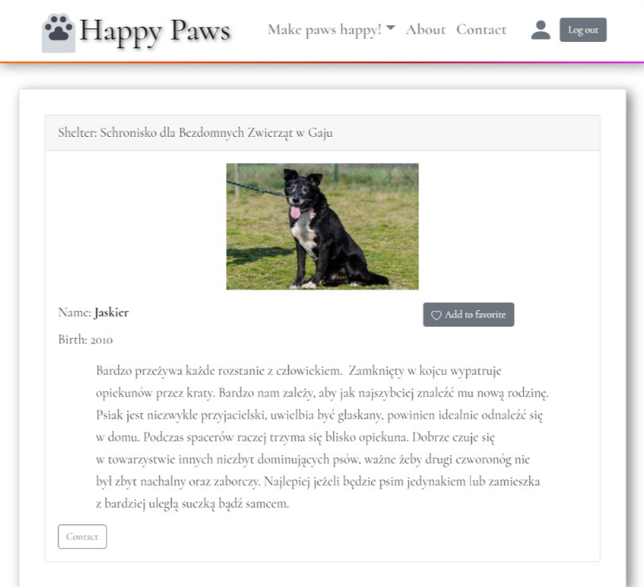
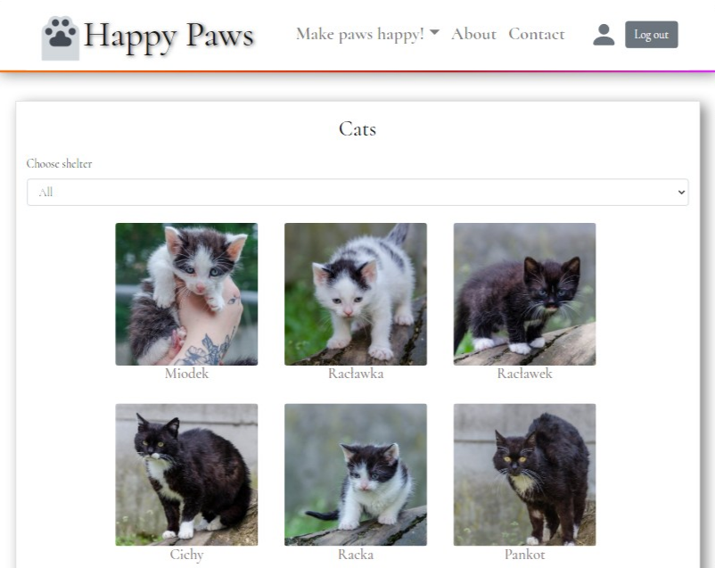
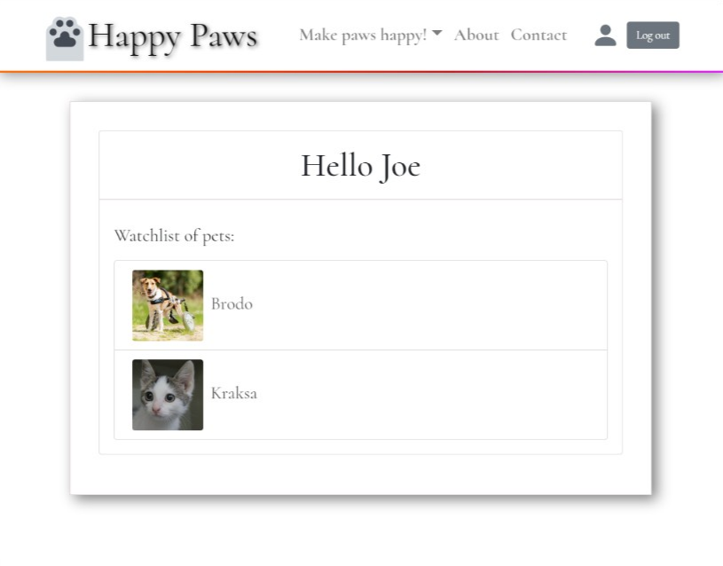

# Happy Paws 🐾
* [General info](#general-info)
* [Source](#source)
* [Tech](#tech)
* [Setup](#setup)


### General info

Happy Paws is a project made as a culmination of a Coders Lab bootcamp.
The aim of this project was to create a website where you can browse animals for adoption from different shelters in one place.

### Source
This project is based on my own idea and design.

### Tech

This project uses:

* [Create React App](https://github.com/facebook/create-react-app)
* [Sass](https://sass-lang.com/) - for styles
* [React Router](https://github.com/ReactTraining/react-router) - for routing
* [Firebase](https://firebase.google.com) - Realtime Database

## Live Demo
[DEMO🔍](https://dominikaozorkiewicz.github.io/Happy_Paws)

Use login and password to test all functionality or register your own user.
```
login: joe@example.test
password: 12345
```

### Setup
To run this project, install it locally using npm:

```
$ cd ../Happy_Paws
$ npm install
```

To run this project correctly, you need to connect it with Firebase:
* Create Firebase account or sign in using Google account
* Create new database for project and import example data from `example_data/data.json`
* Connect project with Firebase. If you don't know what to do, don't worry! [Firebase documentation](https://firebase.google.com/docs) will help you
* Add new file with your Firebase configuration in this path: `src/services/firebaseData.js`

```
// firebaseData.js
export const firebaseKey = "YOUR_DATA";
export const firebaseDomain = "YOUR_DATA";
export const firebaseDatabase = "YOUR_DATA";
export const firebaseProjectID = "YOUR_DATA";
export const firebaseStorageBucket = "YOUR_DATA";
export const firebaseSenderID = "YOUR_DATA";
export const firebaseAppID = "YOUR_DATA";
```

Great! Project is ready to run!🚀
```
$ npm start
```

## Preview





